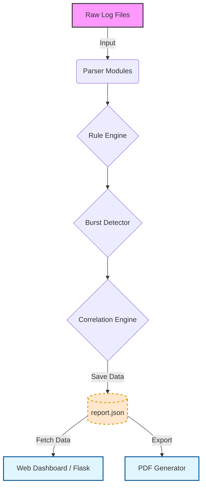

# InsightLog — Advanced Full‑Feature Log Monitoring, Detection & Analysis Framework

---

<p align="center">
  
  
  
  
  
  
</p>

**InsightLog** is an **advanced, full‑featured log analysis framework** inspired by SIEM capabilities.
It provides end‑to‑end log ingestion, signature-based detection, burst/rate anomaly detection, correlation logic, PDF reporting, and a live dashboard — all designed to emulate the workflow of a real security operations environment.

InsightLog supports real‑world workflows such as:

* Investigating attacks using Apache or Syslog data
* Detecting suspicious patterns, brute-force attempts, 404 floods, or unusual behavior
* Analyzing attack timelines
* Generating professional executive PDF reports
* Using custom rules for detections
* Viewing security alert data through a clean dashboard

---

# ⭐ Features

### 🔍 **Log Parsing (Multi‑Format)**

* Apache access logs (combined format)
* Syslog / auth logs
* Handles malformed, inconsistent, and real-world logs

### 🧠 **Detection Engines**

* Rule Engine (signature-based)
* Burst Detection (rate-based anomalies)
* Correlation Engine (multi-alert relationships)

### 📊 **Dashboard (Flask)**

* Overview with charts
* Alerts (categorized by severity)
* Timeline analysis
* Correlation view
* Dark/Light mode
* Auto-refresh

### 🧾 **Reporting**

* Rich `report.json` + `report.csv` outputs
* Fully structured PDF report with:

  * Cover page
  * Summary
  * Charts (Top IPs, Severity, URLs)
  * Alerts table
  * Correlation events
  * Timeline snapshot

### ⚡ **Utilities & Extensibility**

* Plugin system (`/plugins`)
* Rule file support (`rules.txt`)
* Burst stress-test samples
* Real examples in `/samples`

---

# 📸 Dashboard Preview


---

# 🏗 Architecture


---

# 📁 Directory Structure

```
InsightLog/
├── insightlog.py                # CLI tool entrypoint
├── parser/
│   ├── apache_parser.py
│   ├── syslog_parser.py
│   ├── burst_detector.py
│   ├── correlation.py
│   ├── rules_engine.py
│   ├── pdf_export.py
│   ├── utils.py
│   ├── live_monitor.py
│   └── plugin_manager.py
│
├── dashboard/
│   ├── app.py                   # Flask dashboard backend
│   ├── __init__.py
│   ├── static/
│   │   ├── dashboard.js         # Frontend logic
│   │   └── style.css            # Dashboard styling
│   └── templates/
│       └── dashboard.html       # UI layout
│
├── plugins/                     # Custom user plugins
│   └── sample_geo_blocker.py
│
├── samples/                     # Test log files
│   ├── apache_access.log
│   ├── apache_attack.log
│   ├── auth.log
│   ├── burst_test.log
│   └── live_test.log
│
├── output/                      # Generated reports
│   ├── report.json
│   ├── report.csv
│   └── InsightLog_Report.pdf
│
├── rules.txt                    # User-customizable detection rules
├── requirements.txt
└── README.md
```

---

# 📦 Installation

### Clone the repository

```
git clone https://github.com/yourusername/InsightLog.git
cd InsightLog
```

### Install dependencies

```
pip install -r requirements.txt
```

---

# 🚀 Usage (CLI)

### Display Graphical Charts (Matplotlib)

Any command containing `--plot` will generate popup visual charts:

* Top IPs bar chart
* Status code distribution
* Top URLs graph
* Severity breakdown

#### General syntax:

```
python insightlog.py --type <apache|syslog> --file <logfile> --plot
```

### Parse Apache logs

```
python insightlog.py --type apache --file samples/apache_access.log
```

### Parse Syslog

```
python insightlog.py --type syslog --file samples/auth.log
```

### Use rule-based detections

```
python insightlog.py --type apache --file samples/apache_attack.log --rules rules.txt
```

### Debug rule matching

```
python insightlog.py --type apache --file samples/apache_attack.log --rules rules.txt --debug-rules
```

### Trigger burst detection

```
python insightlog.py --type apache --file samples/burst_test.log
```

### Live monitoring

```
python insightlog.py --type syslog --file /var/log/auth.log --live
```

### Display Graphical Charts (Matplotlib)

InsightLog supports **real‑time graphical visualization** using Matplotlib. Any command that includes:

```
--plot
```

will generate popup visual charts such as:

* Top IPs bar chart
* Status code distribution
* Top URLs chart
* Severity breakdown (if present)

#### General syntax:

```
python insightlog.py --type <apache|syslog> --file <logfile> --plot
```


# 🚀 Usage (CLI)

### Display Graphical Charts (Matplotlib)

Any command containing `--plot` will generate popup visual charts:

* Top IPs bar chart
* Status code distribution
* Top URLs graph
* Severity breakdown

#### General syntax:

```
python insightlog.py --type <apache|syslog> --file <logfile> --plot
```

### Parse Apache logs

```
python insightlog.py --type apache --file samples/apache_access.log
```

### Parse Syslog

```
python insightlog.py --type syslog --file samples/auth.log
```

### Use rule-based detections

```
python insightlog.py --type apache --file samples/apache_attack.log --rules rules.txt
```

### Debug rule matching

```
python insightlog.py --type apache --file samples/apache_attack.log --rules rules.txt --debug-rules
```

### Trigger burst detection

```
python insightlog.py --type apache --file samples/burst_test.log
```

### Live monitoring

```
python insightlog.py --type syslog --file /var/log/auth.log --live
```

### Parse Apache logs

```
python insightlog.py --type apache --file samples/apache_access.log
```

### Parse Syslog

```
python insightlog.py --type syslog --file samples/auth.log
```

### Enable rule-based detections

```
python insightlog.py --type apache --file samples/apache_attack.log --rules rules.txt
```

### Debug rule matching

```
python insightlog.py --type apache --file samples/apache_attack.log --rules rules.txt --debug-rules
```

### Trigger burst detection

```
python insightlog.py --type apache --file samples/burst_test.log
```

### Live monitoring (`tail -f` style)

```
python insightlog.py --type syslog --file /var/log/auth.log --live
```

---

# 📜 Rules Documentation

`rules.txt` is **fully user-editable**.
Format:

```
<event> [by_ip] >= <threshold> <SEVERITY>
```

Examples:

```
failed_login by_ip >= 5 ALERT
404 by_ip >= 10 WARNING
ip_requests >= 50 CRITICAL
```

Supports:

* Global matching
* Per-IP matching
* Debug tracing (`--debug-rules`)

---

# ⚡ Burst Detection

Burst detection identifies rapid-fire events across sliding windows:

* 5 seconds
* 30 seconds
* 300 seconds

Example output:

```
[CRITICAL] Burst detected for attacker_ip: 5s, 30s windows exceeded threshold
```

Burst logs can be tested using:

```
samples/burst_test.log
```

---

# 🔗 Correlation Engine

Identifies:

* Multi-rule trigger clusters
* High-impact attacker patterns
* Host/IP-based relationships

Example output:

```
[CORR] IP abc123 triggered 4 alerts from 3 rule categories
```

---

# 📊 Dashboard

Run:

```
cd dashboard
python app.py
```

Open in browser:

```
http://127.0.0.1:5001/
```

Dashboard tabs:

* **Overview** – metrics + charts
* **Alerts** – rule detections
* **Timeline** – chronological event flow
* **Correlations** – grouped attacker behavior

---

# 🧾 PDF Reporting

Export full SIEM-style PDF:

```
http://127.0.0.1:5001/export/pdf
```

Includes:

* Cover page
* Executive summary
* Chart visuals
* Alerts table
* Correlation events
* Timeline snapshot

---

# 📝 Screenshots

## 📊 Matplotlib Charts via `--plot`


* Top IPs Bar Chart


* Status Code Distribution


* Top URLs Graph


  
## 📈 Dashboard Overview


## 🕒 Timeline View


## ⚠ Alerts View


## 🔗 Correlation View


## 🧾 PDF Report Preview


---

---

# 👤 Author

**Alexander P.B.** *Cybersecurity Researcher & Penetration Tester | Red Team & IoT Security Specialist*

📧 Reach out via [GitHub](https://github.com/Alexander-50) for research collaborations.

---
